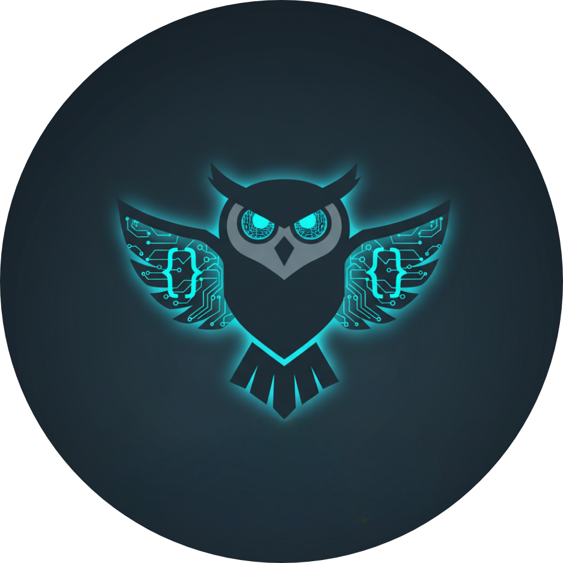

<!-- Header with Photo -->

  

<h1 align="center">Hey 👋 I'm Anant Agrawal</h1>

🚀 <i>Aspiring Software Engineer | Web Developer | Python Enthusiast | AI Explorer</i>

---

## 🎯 Current Goals
✔️ Strengthen **Data Structures & Algorithms** in Python/Java  
✔️ Complete **100 Days of Web Dev** challenge  
✔️ Build **full-stack apps** with Flask + React  
✔️ Participate in **hackathons** & collaborate on open-source  
✔️ Prepare for **internship interviews** with strong projects & coding practice  

---

## 🌟 About Me
- 🎓 I’m a **Computer Science Engineering student at PSIT Kanpur** (currently in 2nd year).  
- 💻 I’m passionate about **building impactful projects** with clean design and practical use.  
- 🛠️ Featured Project **VOKA** → an AI-powered mental well-being app with metahuman assistants.  
- 🌱 I’m currently revising **Python, Web Development, and DSA** while exploring **AI/LLM integration**.  
- 🎯 My goals:  
  - Secure meaningful **internships** in my 2nd/3rd year.  
  - Contribute to **open-source & hackathons**.  
  - Build a solid portfolio of **AI + Web projects**.  

---

## 🔥 Skills & Tools

  

- **Frontend:** HTML, CSS, JavaScript, SCSS  
- **Backend:** Flask (Python)  
- **Programming Languages:** Python, Java (basic DSA)  
- **Version Control:** Git, GitHub
- **Other Interests:** Linux customization, Docker, Unreal Engine (for VOKA project)  

---

## 📂 Featured Projects

### 🌐 Web Development & UI
- 🎨 [**CSS-MySite**](https://github.com/AnantAgrawal29/CSS-MySite) → Responsive personal portfolio-style site.  
- 🪪 [**name-card**](https://github.com/AnantAgrawal29/name-card) → Digital card built with SCSS and custom design.  
- 📄 [**cv**](https://github.com/AnantAgrawal29/cv) → Online résumé/portfolio webpage.  

### ⚙️ Full-Stack
- 📝 [**new-blog-website-complete**](https://github.com/AnantAgrawal29/new-blog-website-complete) → Blog website using Flask, templates, and routing.  

### 📚 Learning Journey
- 💯 [**100-days-of-web-development**](https://github.com/AnantAgrawal29/100-days-of-web-development) → Daily learning and practice of web development fundamentals.  

---

## 📊 GitHub Stats

  
  

  

---

## 📫 Connect With Me

  
  

